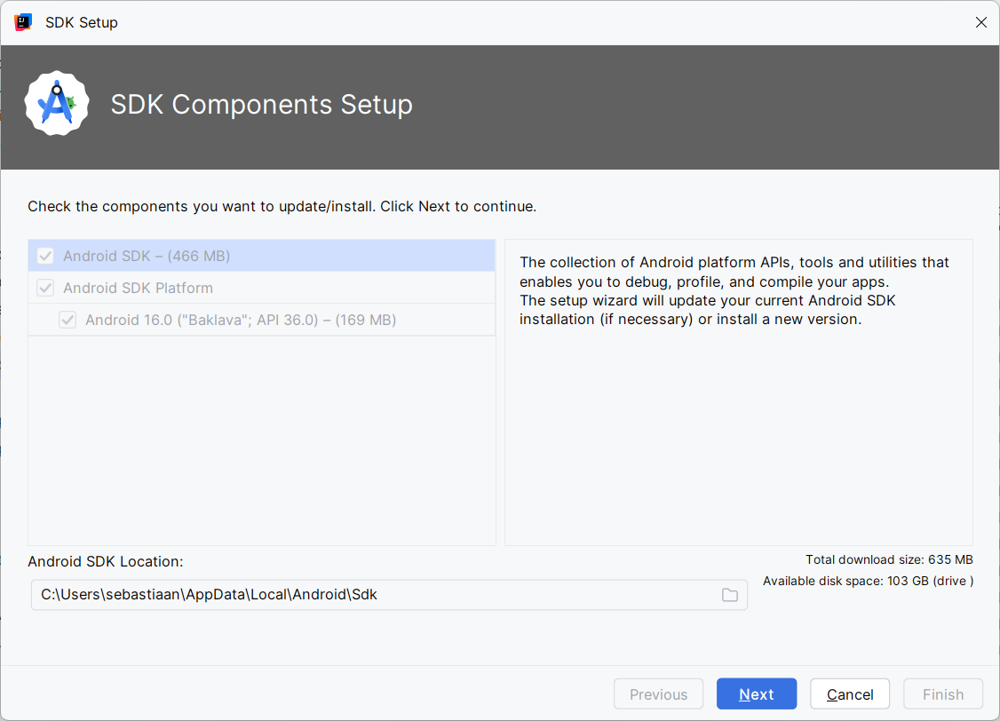
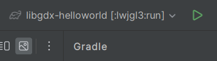
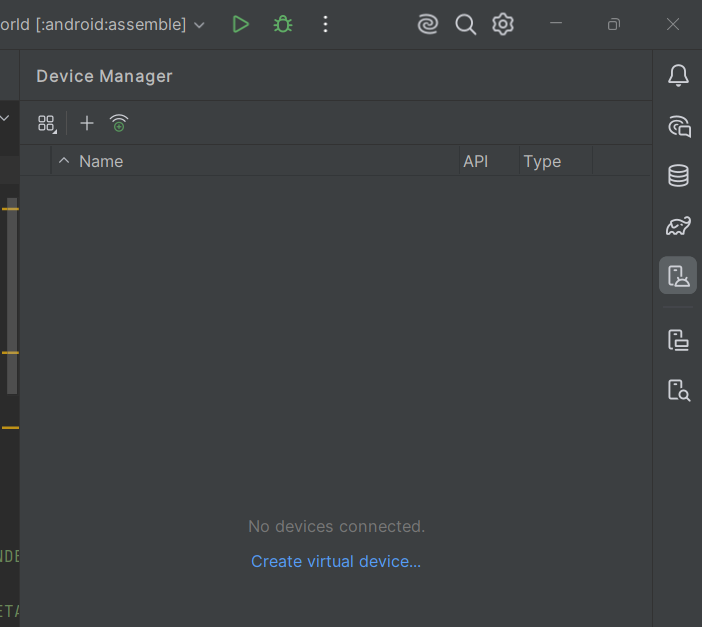
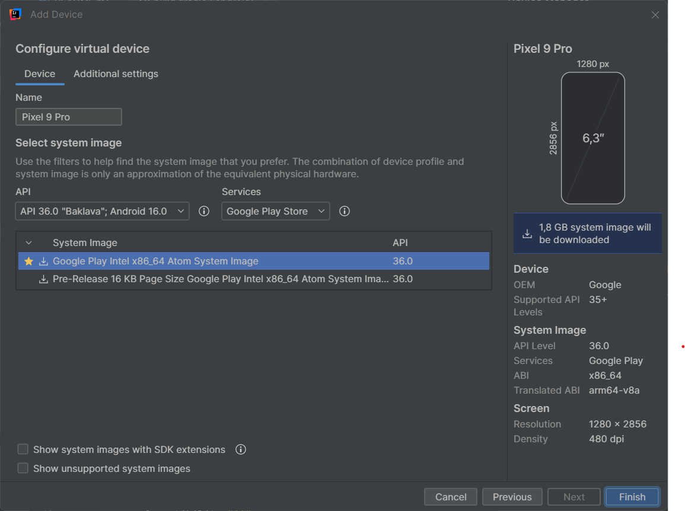
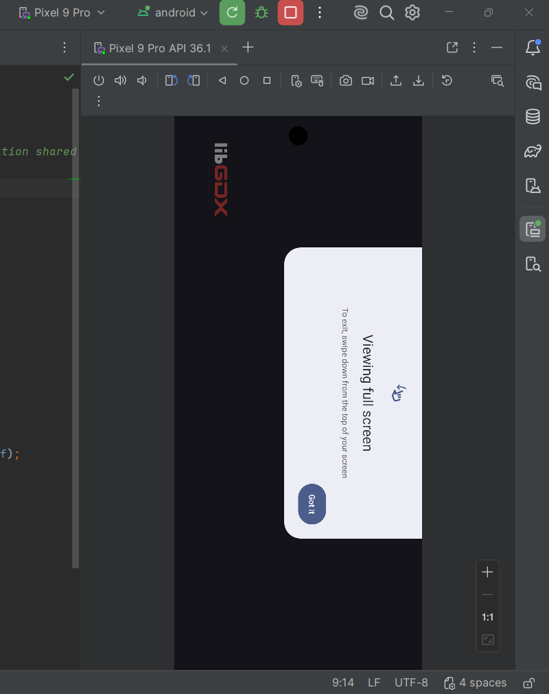

# Java - Starting with game development using LibGDX

Hello and great that you have decided to start coding games using Java. This guide/tutorial will introduce you into the most important basics for 2D and 3D gaming and help you understand the concepts. Please not that this guide is not a place to learn Java itself, this guide expect a good knowledge of Java itself. So if you are net yet familiar with concepts as loops, methods, classes, constructors, packages, inheritance, polymorphism, etc ... I suggest you start with improving your overall knowledge of Java itself.

To help us in developing our code this guide will use a framework, **libGDX** (https://libgdx.com), so we don't have to learn raw OpenGL but can access the functionality more easily. If you want to learn more how rendering realy works or how you can access all features at its core, you better look for a native OpenGL guide. Another reason why libGDX is a good choice, is that it provides cross-platform access and easily lets us guild an executable JAR for Windows, Linux or Mac, port application as runnable website and even a mobile application for Android or iOS.

However since development for iOS is not free and exporting the application as a website is not out-of-the-box, we will focus on this guide for an application that runs through a JAR and Android app.

This guide, and most assets used in it, is largely based on the wiki pages of libGDX itself (https://libgdx.com/wiki/). So all credits to them, I have just updated, rearranged or extended the code where needed to meet the latest libGDX and JDK version that was used in this guide. They also have great community who can help should you have any problems while using the framework.

At the end of each chapter you will be able to find the full code source in the guide, but also a link to the complete project at that point so you can run that should your code not match. Keep in mind that this guide is by no means a full tutorial on all possibilities but it will merely demonstrate the principles. It is up to you to grasp these and then expand your knowledge by experimenting on your own.

### Tools and frameworks versions used in guide

- Android SDK 16 (https://developer.android.com/about/versions/16) [^1]
- Java openJDK 21 (https://openjdk.org/projects/jdk/21/) [^1]
- IntelliJ IDEA 2026.1 (https://www.jetbrains.com/idea/)
- Gradle v8.16.0 (https://gradle.org/)[^1]
- gdx-liftoff v1.14.08 (https://github.com/libgdx/gdx-liftoff/releases/tag/v1.14.0.8)

[^1]:Note that you do not have to download and install these packages. They are either already bundeled with IntelliJ or installed using the IDE itself.

## Content

- [Introduction](#Introduction)
  - [Setting-up environment](#Setting-up environment)
  - [Building and running the application](#Building-and-running-the-application)
  - [Distributing the application](#Distributing-the-application)

## Introduction

### Setting-up environment

Make sure you have the **IntelliJ IDEA** IDE installed, see link above.

#### Android

To access Android in IntelliJ, you first have to install the plugin (https://www.jetbrains.com/help/idea/managing-plugins.html).
In **IntelliJ**, open the **settings**. Then select **plugins** in the left menu and select the **marketplace** tab on the right. Search for the **Android** plugin, install it and restart your IDE after.

Once restarted open the settings again. Under **Languages & Frameworks** you should now see **Android SDK Updater**.
Click on **edit** and IntelliJ should open **SDK Components Setup** asking you to install the **Android SDK** and **Android SDK platform 16 ("Baklava") 36.0**. Change the installation directory if you want and keep clicking next to allow the SDK to be installed.

Once the installation is completed you should return to the settings screen. On this screen the **Android SDK Location** should be filled in correctly and you should also see the box checked next to **Android 16.0**.

#### Java JDK

The JDK will be pulled and added to our project once we run the gradle file provided inside a project. We can skip this step for now.

**You can close IntelliJ for now.**

### Creating a new project

If you successfully managed to install IntelliJ IDEA and the Android plugin with the corresponding SDK, it is time to create our first project. The easiest way to create a new project for libgdx is using the **gdx-liftoff** tool (See link above). Open the tool and you see a similar screen:

The following fields have to be filled in:

- OPTIONS
  - PROJECT NAME: pick any name you want. Since it is our first project I took hello-world
  - PACKAGE: pick a fitting packaging name structure. It must contain at least 2 words separated by a . (e.g. io.github.some_package_name)
  - MAIN CLASS: name of the main class generated, here for example HelloWorld
- ADD-ONS
  - PLATFORMS: Select all the platforms you want to use for your application. Use the + to add more.
    Select at least **Core** and **Desktop**. You have to add Android if you want to generate an apk
  - EXTENSIONS: Add at least **Freetype**, this will help us with using custom fonts later on in this tutorial
- SETTINGS
  - JAVA VERSION: set to 21
  - PROJECT PATH: select a directory where the project will be created
  - ANDROID SDK: select the directory where you installed the Android SDK earlier. This is only visible if u added Android as platform

Before you click **generate** your screen should look like this (Android is enabled):

You can now choose to open your project straight in IntelliJ IDEA and close the gdx-liftoff tool. Once you opened the project **gradle** should automatically start download any missing dependencies like JDK 21. After the initial loading you should get the following view in IntelliJ IDEA:

### Building and running the application

There are several different ways to build and run your application, depending on the platform you use.
Each of the methods involves that you run the gradle task once via the gradle menu. Once you have run the gradle task it will be added in the run configuration menu of IntelliJ IDEA and you can access it there quicker.

#### Desktop application

If you want to run the project as a desktop application, you have to run the **gradle task** lwjgl3 => Tasks => application => run by double clicking it or right clicking and selecting **Run ...** 

If all goes well you should see a screen displaying the libgdx logo as follow:

You can still go trough gradle window to launch the application later if you want but its faster to select it from the runtime configuration drop down and hitting the green arrow on top of the IDE.

#### Android application

Before we can run and test our Android application, we have to add a device on which we want to test to our IDE. To do so open the **device manager** using Tools => Android => Device manager or by clicking on the icon in the righthand menu.

Now click on the + or **Create virtual device...** to add the virtual Android device you want. Make sure that in the second screen you select **API 36** if this was not the case. For instance if you select Pixel 9 Pro as device API 37 will be selected by default, so change this! Select **Google Play Intel x86_64 Atom System Image** and then click **finish** to allow IntelliJ IDEA to download the virtual device.

Once the virutal device is added we can now test/run our application on the device by swapping the **runtime configuration** to android and pressing the green launch button. Beware, this might take a while the first time. If all goes well it should install and launch the app on the virtual device and you should see the libdgx logo once more.

### Distributing the application

If you want to distribute your application to other people you will either provide them with a built **JAR** file for the desktop application or otherwise an **apk** for the mobile app.

#### Desktop application

To build the JAR file there are already 3 gradle tasks predefined which you can execute based on the OS you want to build the JAR for. It is important that you select the **target** os for the build and not the OS you are building it in!

To build a redistributable JAR, open the gradle panel and under Tasks => build you will find **jarLinux**, **jarWin** and **jarMac**. Select the task you want based on the target OS and run it. This will build the JAR file and can be found in **lwjgl3\build\libs** inside your project directory.

#### Android application

When we build the apk there will be a debug and release version that will build. The **debug** version will have a presigned certificate so this will allow you to easily share it! If you want to share a **release** apk you have to first sign it yourself. More info that can be found here [INSERT].

To build the apk, open the gradle panel and under Android =>Tasks => build you will find **assemble**. Select the task and run it. This will build the apk files both **debug** and **release**. These apk files can be found in **android\build\outputs\apk** inside your project directory.
