# Java - Starting with game development using LibGDX

Hello and great that you have decided to start coding games using Java. This guide/tutorial will introduce you into the most important basics for 2D and 3D gaming and help you understand the concepts. Please not that this guide is not a place to learn Java itself, this guide expect a good knowledge of Java itself. So if you are net yet familiar with concepts as loops, methods, classes, constructors, packages, inheritance, polymorphism, etc ... I suggest you start with improving your overall knowledge of Java itself.

To help us in developing our code this guide will use a framework, **libGDX** (https://libgdx.com), so we don't have to learn raw OpenGL but can access the functionality more easily. If you want to learn more how rendering realy works or how you can access all features at its core, you better look for a native OpenGL guide. Another reason why libGDX is a good choice, is that it provides cross-platform access and easily lets us guild an executable JAR for Windows, Linux or Mac, port application as runnable website and even a mobile application for Android or iOS.

However since development for iOS is not free and exporting the application as a website is not out-of-the-box, we will focus on this guide for an application that runs through a JAR and Android app.

This guide, and most assets used in it, is largely based on the wiki pages of libGDX itself (https://libgdx.com/wiki/). So all credits to them, I have just updated, rearranged or extended the code where needed to meet the latest libGDX and JDK version that was used in this guide. They also have great community who can help should you have any problems while using the framework.

At the end of each chapter you will be able to find the full code source in the guide, but also a link to the complete project at that point so you can run that should your code not match. Keep in mind that this guide is by no means a full tutorial on all possibilities but it will merely demonstrate the principles. It is up to you to grasp these and then expand your knowledge by experimenting on your own.

### Tools and frameworks versions used in guide

- Android SDK 16 (https://developer.android.com/about/versions/16) [^1]
- Java openJDK 21 (https://openjdk.org/projects/jdk/21/) [^1]
- IntelliJ IDEA 2026.1 (https://www.jetbrains.com/idea/)
- Gradle v8.16.0 (https://gradle.org/)[^1]
- gdx-liftoff v1.14.08 (https://github.com/libgdx/gdx-liftoff/releases/tag/v1.14.0.8)

[^1]:Note that you do not have to download and install these packages. They are either already bundled within IntelliJ IDEA or installed using the IDE itself.

## Content

- [Introduction](#Introduction)
  - [Setting-up environment](#Setting-up-environment)
  - [Building and running the application](#Building-and-running-the-application)
  - [Distributing the application](#Distributing-the-application)
  - [Conventions](#Conventions)
  - [Project structure](#Project-structure)
- [Basics](#Basics)
  - [Game loop](#game-loop)
  - [Viewport](#viewport)
  - [Camera](#camera)
  - [File Handling](#file-handling)

- [2D](#2D)
  - [Launch settings](#Launch-settings)
  - [Game and screens](#Game-and-screens)
  
- 2.5D
- 3D

## Introduction

### Setting-up environment

Before you go on, make sure you have the **IntelliJ IDEA** IDE installed, see link above.

#### Android

To access Android in IntelliJ IDEA, you first have to install the plugin (https://www.jetbrains.com/help/idea/managing-plugins.html).
In **IntelliJ IDEA**, open the **settings**. Then select **plugins** in the left menu and select the **marketplace** tab on the right. Search for the **Android** plugin, install it and restart your IDE after installation completes.
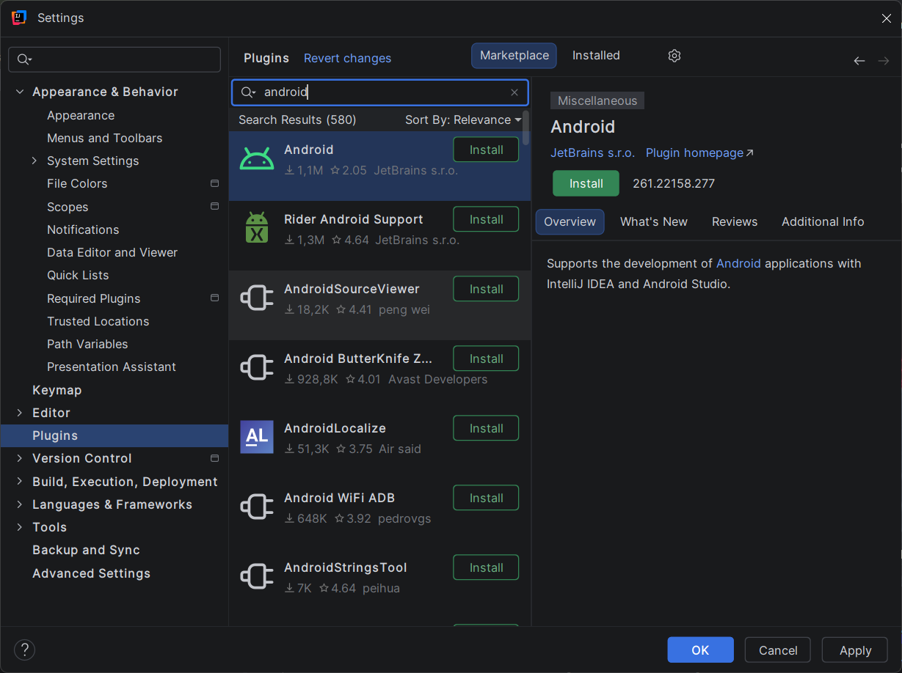

Once restarted open the settings again. Under **Languages & Frameworks** you should now see **Android SDK Updater**.
Click on **edit** and IntelliJ should open **SDK Components Setup** asking you to install the **Android SDK** and **Android SDK platform 16 ("Baklava") 36.0**. Change the installation directory if you want and keep clicking next to allow the SDK to be installed.

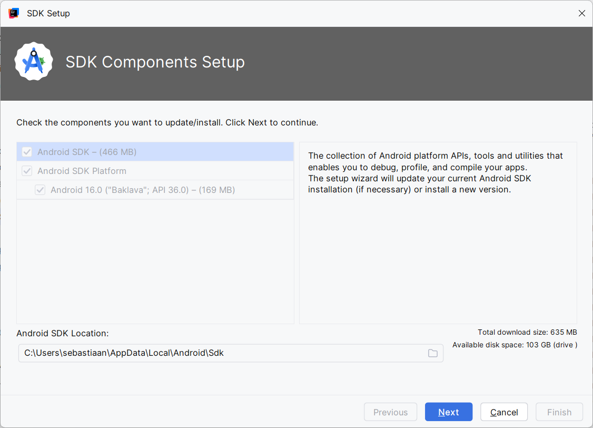

Once the installation is completed you should return to the settings screen. On this screen the **Android SDK Location** should be filled in correctly and you should also see the box checked next to **Android 16.0**. If not, select it and let IntelliJ IDEA download the extra SDK platform.

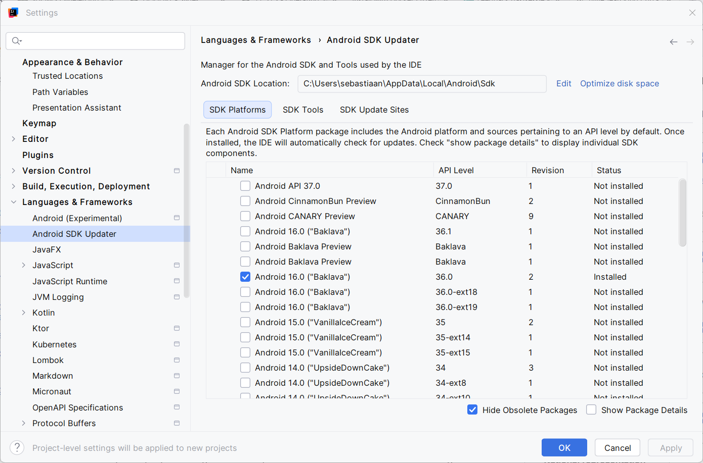

#### Java JDK

The JDK will be pulled and added to our project once we run the **gradle** file provided inside a project. We can skip this step for now.

**You can close IntelliJ for now.**

### Creating a new project

If you successfully managed to install IntelliJ IDEA and the Android plugin with the corresponding SDK, it is time to create our first project. The easiest way to create a new project for libgdx is using the **gdx-liftoff** tool (See link above). Open the tool and you should see a similar screen:

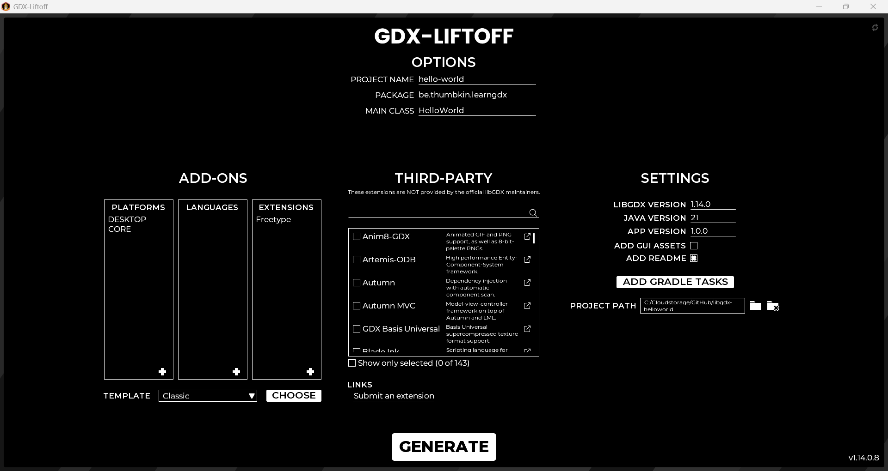

The following fields have to be filled in:

- OPTIONS
  - PROJECT NAME: pick any name you want. Since it is our first project I took hello-world
  - PACKAGE: pick a fitting packaging name structure. It must contain at least 2 words separated by a . (e.g. io.github.some_package_name)
  - MAIN CLASS: name of the main class generated, here for example HelloWorld. This will be the class opened when launching the application.
- ADD-ONS
  - PLATFORMS: Select all the platforms you want to use for your application. Use the + to add more.
    Select at least **Core** and **Desktop**. You have to add Android if you want to generate an apk.
  - EXTENSIONS: Add at least **Freetype**, this will help us with using custom fonts later on in this tutorial.
- SETTINGS
  - JAVA VERSION: set to 21
  - PROJECT PATH: select any directory you want. The project will be created there. It should be an empty folder.
  - ANDROID SDK: select the directory where you installed the Android SDK earlier. This is only visible if you added Android as a platform.

Before you click **generate** your screen should look like this (here Android is enabled):


You can now choose to open your project straight into IntelliJ IDEA and close the gdx-liftoff tool. Once you opened the project **gradle** should automatically start download any missing dependencies like JDK 21. After the initial loading you should get the following view in IntelliJ IDEA:

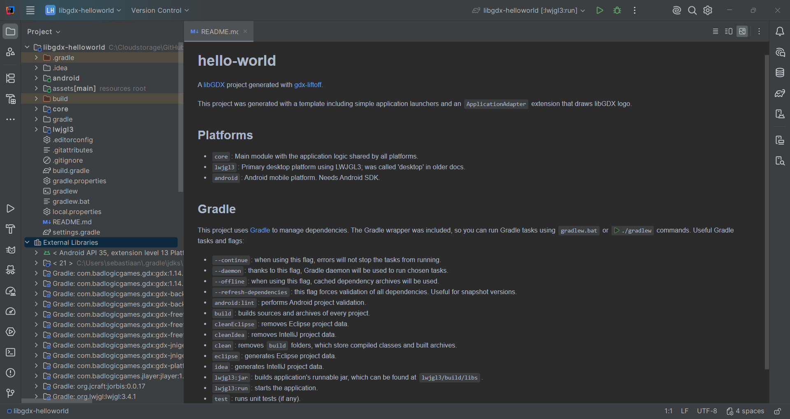

### Building and running the application

There are several different ways to build and run your application, depending on the platform you use.
Each of the methods involves that you run the **gradle task** once first via the gradle menu. Once you have run the gradle task it will be added in the runtime configuration menu of IntelliJ IDEA and you can access it there quicker.

#### Desktop application

If you want to run the project as a desktop application, you have to run the **gradle task** lwjgl3 => Tasks => application => run by double clicking it or right clicking and selecting **Run ...** 

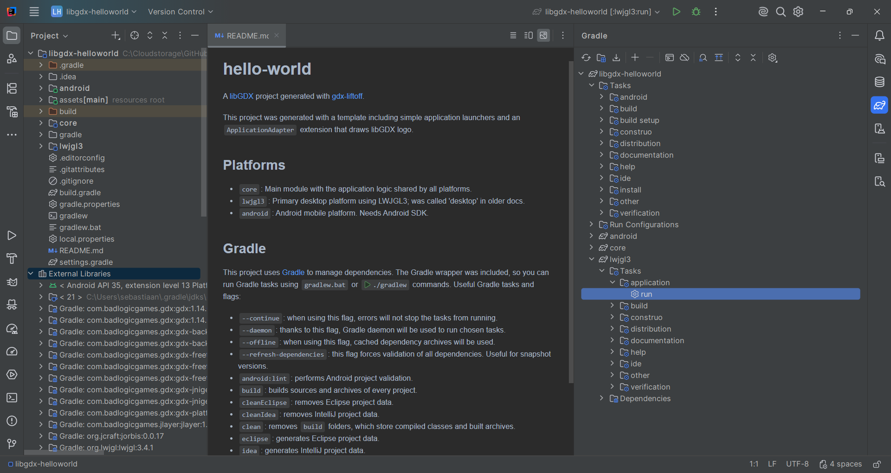

If all goes well you should see a screen displaying the libgdx logo as follow:

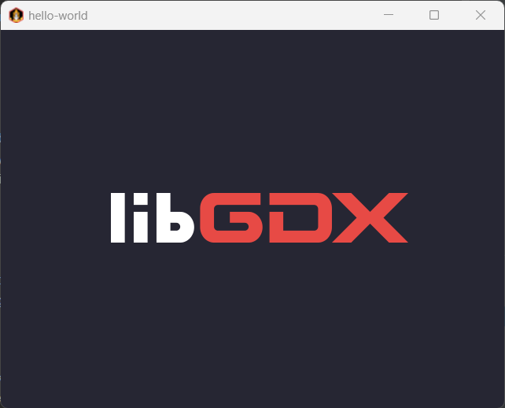

You can still go trough gradle window to launch the application later if you want but its faster to select it from the **runtime configuration** drop down and hitting the green arrow on top of the IDE.

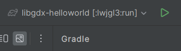

#### Android application

Before we can run and test our Android application, we have to add a device on which we want to test to our IDE. To do so, open the **device manager** using Tools => Android => Device manager or by clicking on the device manager icon in the righthand menu.

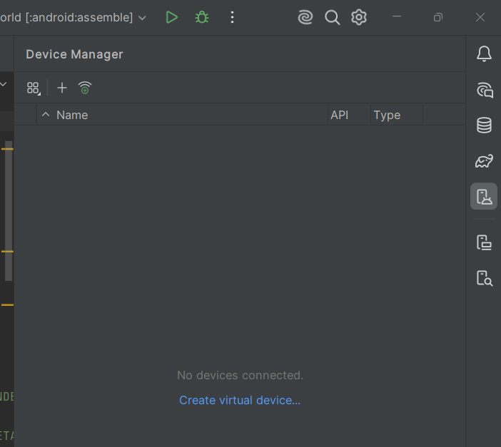

Now click on the + or **Create virtual device...** to add the virtual Android device you want. Make sure that in the second screen you select **API 36** if this was not the case. For instance if you select Pixel 9 Pro as device API 37 will be selected by default, so change this! Select **Google Play Intel x86_64 Atom System Image** and then click **finish** to allow IntelliJ IDEA to download the virtual device.

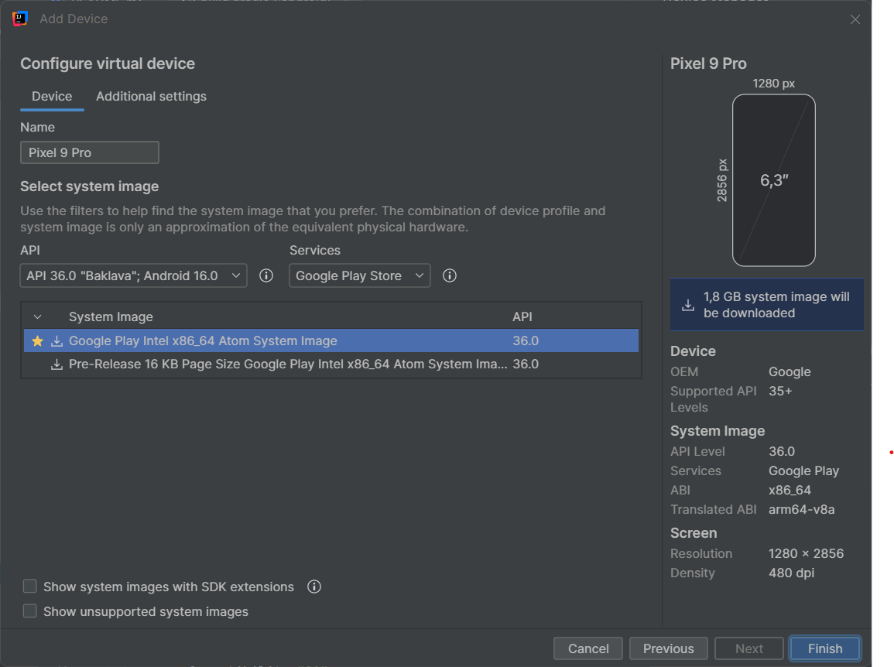

Once the virutal device is added we can now test/run our application on the device by swapping the **runtime configuration** to android and pressing the green launch button. Beware, this might take a while the first time since the virtual machine is generated and booted. If all goes well it should install and launch the app on the virtual device, so you should see the libdgx logo once more.

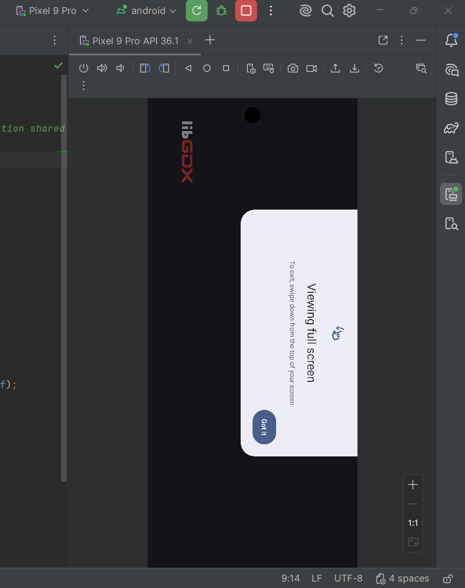

### Distributing the application

If you want to distribute your application to other people you will either provide them with a built **JAR** file for the desktop application or otherwise an **apk** for the mobile app.

#### Desktop application

To build the JAR file there are already 3 gradle tasks predefined which you can execute based on the OS you want to build the JAR for. It is important that you select the **target** os for the build and not the OS you are building it in!

To build a redistributable JAR, open the gradle panel and under Tasks => build you will find **jarLinux**, **jarWin** and **jarMac**. Select the task you want based on the target OS and run it. This will build the JAR file and can be found in **lwjgl3\build\libs** inside your project directory.

#### Android application

When we build the apk there will be a debug and release version that will build. The **debug** version will have a pre-signed certificate so this will allow you to easily share it! If you want to share a **release** apk you have to first sign it yourself. More info that can be found here (https://developer.android.com/studio/publish/app-signing).

To build the apk, open the gradle panel and under Android =>Tasks => build you will find **assemble**. Select the task and run it. This will build the apk files both **debug** and **release**. These apk files can be found in **android\build\outputs\apk** inside your project directory.

### Conventions

During this guide we will use certain assumptions and conventions.

First of all the full class code will not always be included during the chapter. Whenever you see ellipses ... in the code examples, assume that other code has been removed for brevity. Use the context of the lines you can see to figure out where you should be in the file. If you’re completely lost, the complete example is listed at the end of each chapter.

Sometimes code will use a class that is present in multiple packages. Always assume to import the class from the package `com.badlogic.gdx` unless explicitly mentioned otherwise in the text. E.g. the class Rectangle has multiple options, we always pick the `com.badlogic.gdx` variant of the class. 

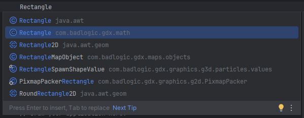

### Project structure

Once you open your project you will notice the following directories are present:

- android (if selected as plaftorm)
- assets
- build
- core
- gradle
- lwjgl3

#### Android

As the name suggests, this folder contains all the code need to run the application as a mobile application and build the apk. We do not have to modify any code here, just alter the files under **libs** and **res** to include our own icons instead of the default ones.

#### Assets

The assets directory will be the main place where we put all the assets we will use for our project, e.g. images, textures, sounds, ... During the project we will create subdirectories here for each type of asset to keep it structured and organised.

#### Build

Folder we can ignore, this is used to generate problem reports should they arrise.

#### Core

This is our main directory where we will do all the coding. All our source code will be added here in the subdirectory **src/main/java/<package name>**.

#### Gradle

Again a folder we can ignore, is used by the gradle wrapper to perfom the gradle tasks.

#### Lwjgl3

Since libgdx is a wrapper framework built on top of **lwjgl3** (Lightweight Java Game Library, https://www.lwjgl.org) this directory will include the class **Lwjgl3Launcher**, under **src/main/java/<package name>**, that actually launches our application. We do not have to modify the code here but we will explain some settings you can do here to launch your application in a certain way, e.g. running it full screen or in a certain resolution.

Also in the subdir **icons** you will have to replace the icons with your own icons if you want to personalize it.

## Basics

Before we dive into actual code and start writing our first (simple) game we will go over some basic principles used developing any game. We will discuss the topics here briefly and elaborate more on them later in their designated chapters throughout the guide. 

#### Game loop

At the hearth of each game is the **game loop**. This is what keeps our game running and shows the graphics on the screen. When you launch the game, there are basically three phases in which the application exists. 

First we have the initialization phase. This is where our game is loaded and all the necessary assets to start are loaded and created. Once the needed assets are loaded the actual game is launched and we can go on the next phase, the game loop.

During this phase the game enters an endless loop in which each frame that is rendered, the following steps should be executed: process user input, update game state/objects, render the frame on screen. The faster those 3 steps are executed the higher the FPS (Frames Per Second) and smoother our game will be. So it is critical that these 3 steps are as optimized as possible.

After the game loop phases finishes we execute the last phase: shutting down the application and cleaning up all the resources.

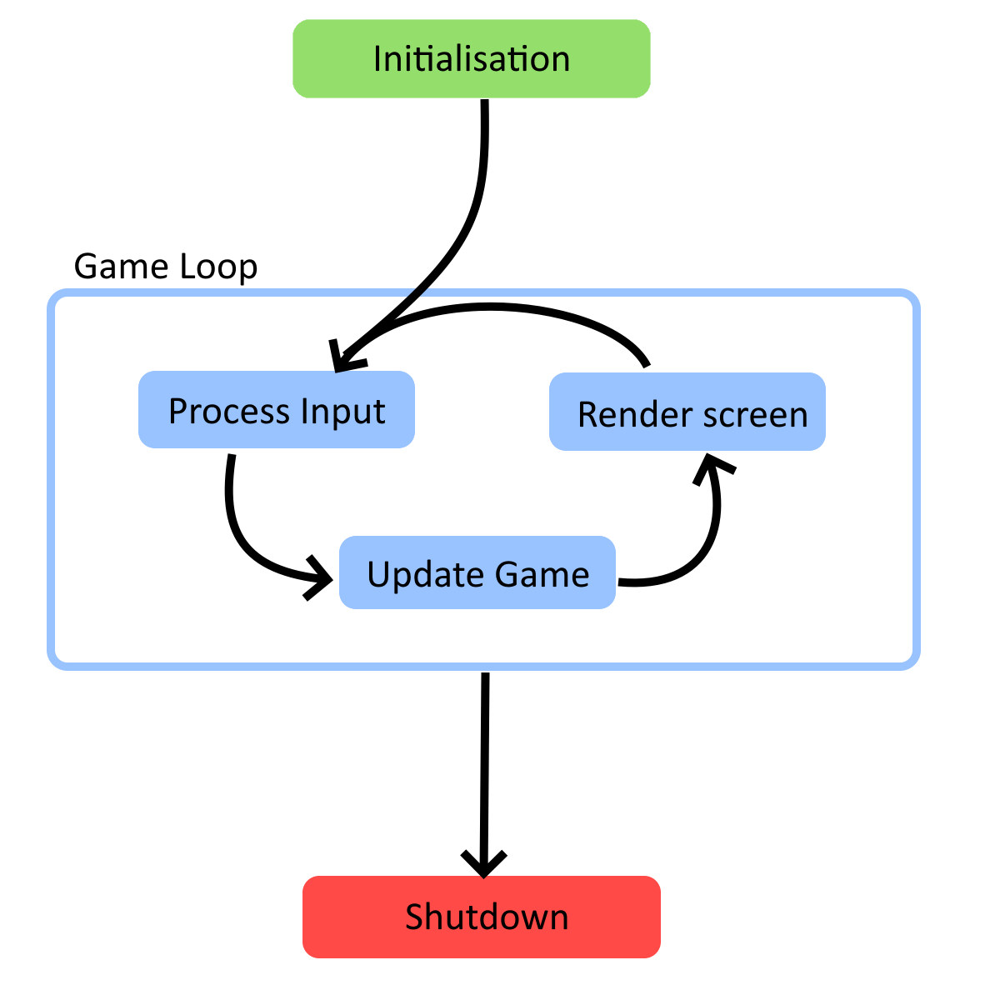

Each screen we want to use and render in our game has to implement the **ApplicationListener**. By implementing the interface we get access to the following methods:

- create(): Method called once when the application is created.
- render(): Method called by the game loop from the application every time rendering should be performed. Game logic updates are usually also performed in this method.
- resize(int width, int height): This method is called every time the game screen is re-sized and the game is not in the paused state. It is also called once just after the `create()` method.
- pause(): On Android this method is called when the Home button is pressed or an incoming call is received. On desktop this is called when the window is minimized and just before `dispose()` when exiting the application. This is a good place to save the game state.
- resume(): This method is called on Android, when the application resumes from a paused state, and on desktop when unminimized.
- dispose(): Called when the application is destroyed. It is preceded by a call to `pause()`.

All methods are called in a thread that has the OpenGL context current. You can thus safely create and manipulate graphics resources.

The following diagram illustrates the life-cycle visually:

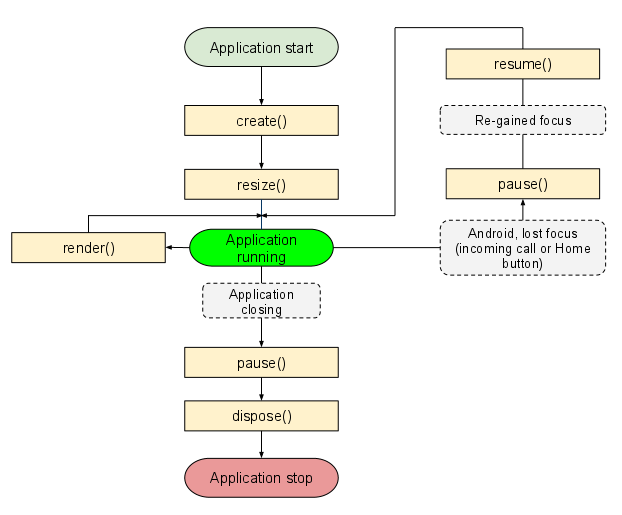

We can either implement **ApplicationListener** but we can also opt to extend the interface as a **Game** or **Screen**. 

A **Game** is an ApplicationListener that supports multiple screens. You can create multiple screens and switch between them using **setScreen**.
A **Screen** is exactly what it sounds like; it's what will be displayed at that given time. Maybe it's a main menu, maybe it's the actual game.

It's recommended you use the Game class for the base of your game, then create multiple Screen instances of the different possible game states you will have.

#### Viewport

The viewport is basically our view on our virtual world in which our objects/models exist. Since like the real world everything exists in 3D the viewport uses 3 coordinates, x, y, and z, to place objects in the world. For 2D games we set the z coordinate to 0 so only use the x and y plane for our 'flat' objects. The coordinates itself are in **float** format. How much we can actually view of our virtual world is determined by the size of our viewport when we create it.

There are many kinds of viewports you can use. A simple one to understand is the **FitViewport** which will ensure that no matter what size our window is, the full game view will always be visible. The parameters determine how large our visible game world will be in game units. It will “fit” into the window. Each viewport also has a camera which controls what part of the game world is visible and at what zoom and which angle. 

More info on types of viewports can be found in the wiki (https://libgdx.com/wiki/graphics/viewports).

It is also possible to have more then one viewport in the game, e.g. if u have a split screen game that would require a viewport for each player.

#### Camera

To actually see the viewport on the screen we have to look at it from a certain point of view. To do so we need to create a camera. A camera allows us to zoom in/out on to the world or even rotate the way we look at it. Keep in mind that the viewport is static and does not rotate or scale. That is where the camera comes in. It manipulates the way we look at the viewport. We can move, rotate or zoom with our camera to alter the way we see the viewport.

We need to define 3 parameters when using the camera:

- Viewing angle: This sets how wide the view is on the viewport or how much of the scene we can see. This is usually around 70 degrees. The higher you set this value the 'wider' the view will be and feel more 'stretched'.
- Position: The actual position the camera is set at in our viewport using xyz coordinates
- Direction: The direction, again a vector with xyz float coordinates, determines where we look at in the viewport

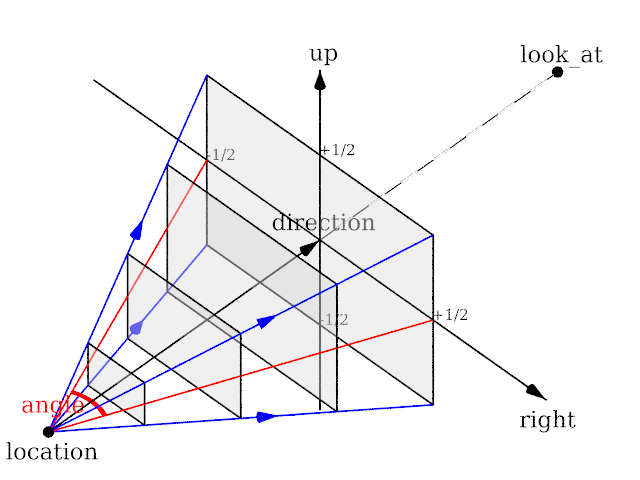

#### File handling

Since we will have to handle a lot of files, being it images, textures, sounds, ... lets dive a bit deeper into the matter here. A file in libGDX is represented by an instance of the **FileHandle** class. A FileHandle has a type which defines where the file is located. The following table illustrates the availability and location of each file type for each platform.

|  *Type*   | *Description, file path and features*                        | *Desktop* | *Android* | *HTML5* | *iOS* |
| :-------: | :----------------------------------------------------------- | :-------: | :-------: | :-----: | :---: |
| Classpath | Classpath files are directly stored in your source folders. These get packaged with your jars and are always *read-only*. They have their purpose, but should be avoided if possible. |    Yes    |    Yes    |   No    |  Yes  |
| Internal  | Internal files are relative to the application’s *root* or *working* directory on desktops, relative to the *assets* directory on Android, and relative to the `core/assets/` directory of your GWT project. These files are *read-only*. If a file can’t be found on the internal storage, the file module falls back to searching the file on the classpath. Relative paths (`./` or `../`) are not always supported and thus shouldn’t be used. |    Yes    |    Yes    |   Yes   |  Yes  |
|   Local   | Local files are stored relative to the application’s *root* or *working* directory on desktops and relative to the internal (private) storage of the application on Android. Note that Local and internal are mostly the same on the desktop. |    Yes    |    Yes    |   No    |  Yes  |
| External  | External files paths are relative to the home directory of the current user on desktop systems. On Android, the app-specific external storage is used. |    Yes    |    Yes    |   No    |  Yes  |
| Absolute  | Absolute files need to have their fully qualified paths specified. *Note*: For the sake of portability, this option must be used only when absolutely necessary |    Yes    |    Yes    |   No    |  Yes  |

Absolute and classpath files are mostly used for tools such as desktop editors, that have more complex file i/o requirements. For games these can be safely ignored. The order in which you should use the types is as follows:

- **Internal Files**: all the assets (images, audio files, etc.) that are packaged with your application are internal files. If you use the Setup UI, just drop them in your Android project’s `assets` folder.
- **Local Files**: if you need to write small files, e.g. save a game state, use local files. These are in general private to your application. If you want a key/value store instead, you can also look into [Preferences]([EIGEN LINK IN GUIDE PLAATSEN]). Note that Android’s app-specific cache can be accessed using ‘../cache’. Files stored there can be cleared by the user via the ‘clear cache’ button found in the app’s settings.
- **External Files**: if you need to write big files, e.g. screenshots, or download files from the web, they could go on the external storage. Note that the external storage is volatile, a user can remove it or delete the files you wrote. Because they are not cleaned up and volatile, it is usually simpler to use local file storage.

How to handle files in the project itself will be discussed once we load our first file.

## 2D

During this chapter we will discuss all the basic skills and mechanics needed to make a simple 2D game. This is considerably easier then diving straight into 3D cause we do not need any models yet for our game but we can just use simple images and move/animate those.

The game we will create is called **drops** and its goal is to catch as many raindrops falling as you can using a bucket. 
:bangbang: Before we start coding the game, please create a new project using the instructions from the introduction. I have used the following values:

- Project name: drops
- Package: be.thumbkin.learngdx
- Main class: DropsGame

:warning: You can change these values but keep in mind that every code fragment used in this chapter is based on the above values, so if you change these you will have to change some code as well in the fragments!

:bulb:After this chapter you will have a basic understanding of:

- Setting options before launching game
- Using a game class
- Loading/swapping between screens
- Loading images and use them as background or sprite
- Animating Sprites
- Rendering a scene
- Managing assets
- Playing an audio file
- Loading/saving variables using preferences
- Converting between world coordinates (3D) and screen coordinates (2D)
- Collision detection
- Capturing user input

### Launch settings

Before we start our own code lets have a quick look at what happens when our game itself launches and which options we can set. When you launch the project the class **Lwjgl3Launcher**, which contains the main method, will be launched.

Lets have a look at the source code in it. You can find the class **Lwjgl3Launcher.java** in the folder **lwjgl3\src\main\java\\<your package>**.

```Java
package be.thumbkin.learngdx.lwjgl3;

import com.badlogic.gdx.backends.lwjgl3.Lwjgl3Application;
import com.badlogic.gdx.backends.lwjgl3.Lwjgl3ApplicationConfiguration;
import be.thumbkin.learngdx.DropsGame;

/** Launches the desktop (LWJGL3) application. */
public class Lwjgl3Launcher {
    public static void main(String[] args) {
        if (StartupHelper.startNewJvmIfRequired()) return; // This handles macOS support and helps on Windows.
        createApplication();
    }

    private static Lwjgl3Application createApplication() {
        return new Lwjgl3Application(new DropsGame(), getDefaultConfiguration());
    }

    private static Lwjgl3ApplicationConfiguration getDefaultConfiguration() {
        Lwjgl3ApplicationConfiguration configuration = new Lwjgl3ApplicationConfiguration();
        configuration.setTitle("drops");
        //// Vsync limits the frames per second to what your hardware can display, and helps eliminate
        //// screen tearing. This setting doesn't always work on Linux, so the line after is a safeguard.
        configuration.useVsync(true);
        //// Limits FPS to the refresh rate of the currently active monitor, plus 1 to try to match fractional
        //// refresh rates. The Vsync setting above should limit the actual FPS to match the monitor.
        configuration.setForegroundFPS(Lwjgl3ApplicationConfiguration.getDisplayMode().refreshRate + 1);
        //// If you remove the above line and set Vsync to false, you can get unlimited FPS, which can be
        //// useful for testing performance, but can also be very stressful to some hardware.
        //// You may also need to configure GPU drivers to fully disable Vsync; this can cause screen tearing.

        // 720p resolution
        configuration.setWindowedMode(1280, 720);
        //// You can change these files; they are in lwjgl3/src/main/resources/ .
        //// They can also be loaded from the root of assets/ .
        configuration.setWindowIcon("libgdx128.png", "libgdx64.png", "libgdx32.png", "libgdx16.png");

        //// This could improve compatibility with Windows machines with buggy OpenGL drivers, Macs
        //// with Apple Silicon that have to emulate compatibility with OpenGL anyway, and more.
        //// This uses the dependency `com.badlogicgames.gdx:gdx-lwjgl3-angle` to function.
        //// You would need to add this line to lwjgl3/build.gradle , below the dependency on `gdx-backend-lwjgl3`:
        ////     implementation "com.badlogicgames.gdx:gdx-lwjgl3-angle:$gdxVersion"
        //// You can choose to add the following line and the mentioned dependency if you want; they
        //// are not intended for games that use GL30 (which is compatibility with OpenGL ES 3.0).
        //// Know that it might not work well in some cases.
//        configuration.setOpenGLEmulation(Lwjgl3ApplicationConfiguration.GLEmulation.ANGLE_GLES20, 0, 0);

        return configuration;
    }
}
```

As you can see in the above code, the game spawns a new **Lwjgl3Application** using a default **Lwjgl3ApplicationConfiguration**.
You can set some options in the ``getDefaultConfiguration()`` method like:

- setTitle(String title): sets the title shown on the frame
- useVsync(boolean status): whether to use vsync or not
- setWindowedMode(int width, int height): set the resolution of the frame, width and height are integers counted in pixels
- setResizable(boolean status): whether or not the window can be resized. Ignored if working fullscreen

If you want to run the application **fullscreen**, comment out or remove the line with ``setWindowedMode(int width, int height)`` and add the following one instead:

```Java
configuration.setFullscreenMode(Lwjgl3ApplicationConfiguration.getDisplayMode());
```

Since we are adding our own game code from now on, we will only add/modify files in the **core\src\main\java\\<your package>** folder. Feel free to adjust any settings in the configuration to your liking. So every file added or openen will be located in the above folder, unless specified otherwise.

**The resolution is changed to 1280x720** in our configuration!

### Game and screens

Open the main class **DropsGame** in **DropsGame.java** and clear the pregerenerated code by the gdx-loftoff, present and only keep the code as an empty class:

````java
package be.thumbkin.learngdx;

public class DropsGame {
}
````

Since our game will consist of several seperate screens, begin main menu, game and options, we will use **DropsGame** as a **Game** class and use it to call each other screen when needed. This means that DropsGame is the main class of our application so it will hold all the information about the game when the application is run. Note that since we extend **Game** we have to override the implementation of ``create()``,``render()`` and ``dispose()``.

#### Create

We will start with the ``create()`` method. This method is called when our game is launched. That means that we have to (pre)load all the resources needed here to show the first screen of our game being the main menu. Lets go ahead first and extend our class as **Game** and add the empty ``create()``.

````Java
package be.thumbkin.learngdx;

import com.badlogic.gdx.Game;

public class DropsGame extends Game {
    @Override
    public void create() {
    }
}
````

Since the viewport will be shared across all screens, we have to create it in our DropsGame. We want it to fit the whole frame no matter the size, so we opt for a **FitViewport**. Since my monitor uses a 16:9 aspect ratio, and is confirm the used window resolution of our game, this is also the aspect ratio I use when we create our viewport:

```Java
package be.thumbkin.learngdx;

import com.badlogic.gdx.Game;    
import com.badlogic.gdx.utils.viewport.FitViewport;

public class DropsGame extends Game {
    public FitViewport viewport;

    @Override
    public void create() {
        // aspect ratio of 16:9 with 1280x720 resolution
        viewport = new FitViewport(16, 9);
    }
}
```

#### Render

The rendering itself will be done in each individual screen itself but the rendering on the game class will still be called. Therefor we just add a ``render()`` and call the rendering method of the super class Game.

``` Java
    @override
	public void render() {
        super.render(); // important!
    }
```

:warning: A common mistake is to forget to call `super.render()` with a Game implementation. Without this call, the Screen that you set in the `create()` method will not be rendered if you override the render method in your Game class!

#### Dispose

The last method we add to our game class for now is ``dispose()``. The only thing that happens here is disposing of any assets and disposing the current active screen. Since we do not have any assets yet, we will just add the dispose for the current active screen, if there is any. 

```Java
    @Override
    public void dispose() {
        if(this.getScreen() != null) this.getScreen().dispose();
    }
```

If you do not dispose of assets and screens when no longer used, you will create memory leaks!

#### Changing active screen

We will now add the first screen on our game. Since the most important screen is the game screen itself we will start with that one. First make a new package **screens** to hold the code for all screens and than add a new class **GameScreen** that implements **Screen** in it:

```Java
package be.thumbkin.learngdx.screens;

import com.badlogic.gdx.Screen;

public class GameScreen implements Screen {
    @Override
    public void show() {

    }

    @Override
    public void render(float delta) {

    }

    @Override
    public void resize(int width, int height) {

    }

    @Override
    public void pause() {

    }

    @Override
    public void resume() {

    }

    @Override
    public void hide() {

    }

    @Override
    public void dispose() {

    }
}
```

:warning: Note that a screen does not have ``create()`` function, so instead we will have to add a constructor to perform actions when the screen is made. Since our **DropsGame** class contains all the necessary game assets and info, we will pass it along to our **GameScreen** and keep it as variable for later use in the individual methods:

```Java
package be.thumbkin.learngdx.screens;

import be.thumbkin.learngdx.DropsGame;

import com.badlogic.gdx.Screen;

public class GameScreen implements Screen {
    final DropsGame game;

    public GameScreen(final DropsGame game) {
        this.game = game;
    }

...
```

As we now have a screen we can create it and set it as active screen in **DropsGame**'s ``create()``

```Java
    @Override
    public void create() {
        viewport = new FitViewport(16, 10);

        this.setScreen(new GameScreen(this));
    }
```

It is also good practice to recreate the screen whenever you need it again and not create all screens at launch and keep them around in variable. This is the most performant.

#### Loading textures

When you launch the application it will currently only show a black frame so it's time to change that! Our base game will use a total of 3 images: a background, a bucket and a rain drop. We will start by adding and rendering the bucket on the screen.

First we have to add the image to our project. So create a folder named **images** under **assets** and add **bucket.png** in it. Then we can load the image as a texture by adding the code to ``create()`` of our **GameScreen**:

```Java
package be.thumbkin.learngdx.screens;

import be.thumbkin.learngdx.DropsGame;

import com.badlogic.gdx.Screen;
import com.badlogic.gdx.graphics.Texture;

public class GameScreen implements Screen {
    final DropsGame game;

    private Texture bucketTexture;

    public GameScreen(final DropsGame game) {
        this.game = game;
		// Alter the path passed if you did not place the image in assets\images
        bucketTexture = new Texture("images/bucket.png");
        
	    spriteBatch = new SpriteBatch();
    }

...
```

A 2D image is called a **Sprite** and to render all sprites in a certain order we will use a **SpriteBatch**. So lets go ahead and try to draw our bucket on the screen. This means we have to add code to ``render(float delta)`` in **GameScreen**. Notice that this method has a parameter **float delta** and the ``render()`` method of a class extending Game does not!. The delta time is the amount of time in seconds since the last time render was called.

```java
    @Override
    public void render(float delta) {
        // Clear the screen with a black color
		ScreenUtils.clear(Color.BLACK);
        // Activate the current viewport to render
        game.viewport.apply();
        // 
        spriteBatch.setProjectionMatrix(game.viewport.getCamera().combined);
        
        // Start rendering images
        spriteBatch.begin();

        // draw the background
        spriteBatch.draw(bucketTexture, 0, 0, 1, 1); 

        // End rendering
        spriteBatch.end();
    }

```

If all goes well you should now see the bucket painted in the lower left corner of the screen when the application is run!

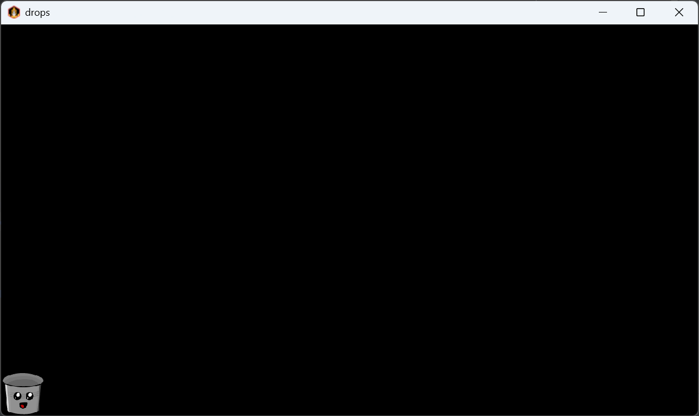
